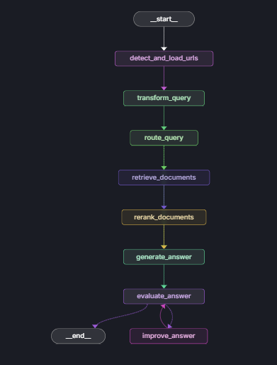

# LangGraph Agent với Memory, Research, Retrieval và ReAct

Tính năng:
- **Query Transformation**: Tạo thêm các câu hỏi từ câu hỏi gốc
- **Intelligent Routing**: Định tuyến đến đúng document
- **Document Retrieval**: Tìm kiếm với RRF fusion
- **Re-ranking**: Xếp hạng lại theo relevance
- **Answer Generation**: Tạo câu trả lời từ context
- **Quality Evaluation**: Đánh giá chất lượng tự động
- **Self-Correction**: Cải thiện nếu cần thiết

## Cài đặt

1. Clone project và cài đặt dependencies:
```bash
python -m pip install -e .
```

2. Cấu hình environment variables trong file `.env`:
```bash
GOOGLE_API_KEY=your_google_api_key_here
LANGSMITH_TRACING=true
LANGSMITH_ENDPOINT=https://api.smith.langchain.com
LANGSMITH_API_KEY=your_langsmith_api_key_here
LANGSMITH_PROJECT=langgraph-agent
# Chroma DB settings
CHROMA_DB_PATH=./data/chroma_db

# Model settings
EMBEDDING_MODEL=all-MiniLM-L6-v2
LLM_MODEL=gemini-2.5-flash
TEMPERATURE=0.1
```

3. Chạy trên LangSmith
```bash
pip install langgraph-cli
langgraph dev
```

## Tính năng

### 1. Workflow Process

- Query Transformation:
  - Multi-variant queries: Tạo 3 phiên bản khác nhau của câu hỏi
  - Synonym expansion: Sử dụng từ đồng nghĩa và cách diễn đạt khác
  - Context enrichment: Thêm context và làm rõ chi tiết
- Intelligent Routing: 
  - Route classification: vectorstore, websearch, direct_response
  - Cost optimization: Chỉ retrieve khi cần thiết
  - Response quality: Tối ưu theo từng loại câu hỏi
- Document Retrieval:
  - Chunking strategy: RecursiveCharacterTextSplitter với overlap
  - Multi-level storage: ChromaDB với cosine similarity
  - Metadata enrichment: Source, title, chunk info
- Re-ranking: 
  - Reciprocal Rank Fusion: Kết hợp kết quả từ multiple queries
  - Similarity filtering: Lọc theo threshold 0.3
  - LLM-based re-ranking: Đánh giá relevance bằng Gemini
- Self-Correction:
  - Quality metrics: Accuracy, relevance, completeness, clarity
  - Automatic retry: Tối đa 2 lần với improvement prompt
  - Feedback loop: Sử dụng evaluation feedback để cải thiện

### 2. Graph Flow
<div align="center">
  
</div>